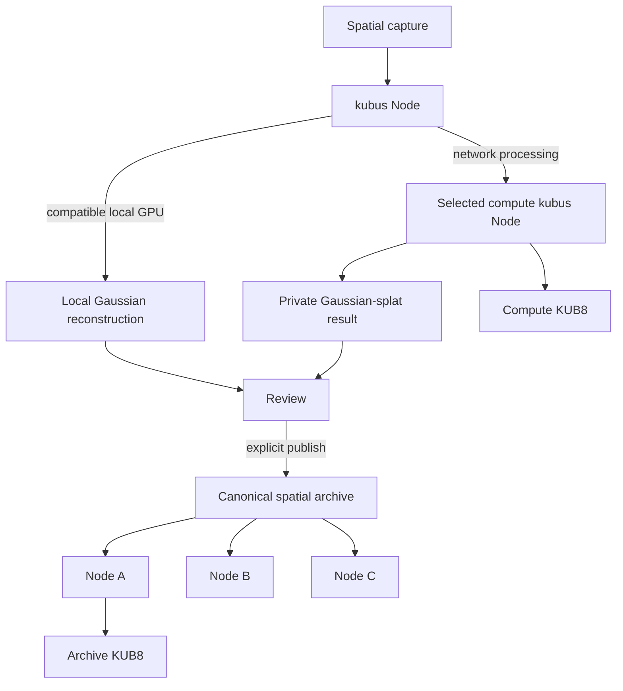

# kubus Node

### Local & distributed Gaussian splatting for a decentralised spatial archive.

Process spatial captures on your own GPU — or use an available GPU on the
Kubus network. Published spatial archives are distributed through
community-run nodes instead of depending on a single storage provider.

**Your GPU when you have one. The Kubus network when you don't.**

> kubus Node is a network participant, not a standalone Gaussian-splatting
> utility. The official runtime makes spatial-processing functionality
> available while the node is actively contributing storage and availability
> to the public art archive.

**Private compute in exchange for public infrastructure.** Operators receive local reconstruction, private local jobs, spatial-archive access and optional distributed GPU access. In return, every active official runtime must contribute backend-policy-compliant capacity to the canonical public archive.



## In 30 seconds

kubus Node combines five boundaries in one source-available runtime:

- a Kubo/IPFS public archive participant with deterministic, byte-aware HOT/WARM/COLD replication;
- a paired `/local/v1` API for art.kubus without exposing operator credentials;
- an optional NVIDIA/CUDA Nerfstudio + gsplat worker for local Gaussian-splat reconstruction;
- an optional distributed-compute provider that receives encrypted temporary IPFS payloads under backend-issued leases;
- deliberate CID-first publication: private inputs and outputs are never canonical merely because a node reports them.

The art.kubus backend is the matchmaking and canonical trust boundary. It does not proxy large capture bytes and it is not a central Gaussian-processing server.

## Local Gaussian splatting

The local path is phone → paired node → private capture → local NVIDIA GPU → private preview → user review → optional publication. Raw RGB, camera poses, intrinsics and depth remain below the node's private data root. Local/self jobs create no compute reward.

The worker uses the official Nerfstudio `1.1.5` image, `splatfacto`, and pinned `gsplat 1.5.3`. NVIDIA/CUDA is the only supported reconstruction target in this alpha. CPU reconstruction is not claimed or silently simulated.

## Distributed GPU compute

GPU sharing is opt-in. A requester discovers fresh, contributing, compatible nodes; chooses automatic ranking or a specific provider; encrypts the capture locally with AES-256-GCM; wraps the data key to the provider's X25519 key through HKDF; and adds only encrypted bytes to Kubo. The provider temporarily pins, decrypts and processes those bytes, returns content-addressed output, and removes its plaintext work directory.

The remote provider necessarily sees plaintext source data while running the job. Transport encryption protects the path and backend, not against the selected provider. For maximum privacy, process locally.

## Mandatory network participation

`NetworkParticipationGate` exposes `UNCONFIGURED`, `JOINING`, `CONTRIBUTING`, `DEGRADED`, and `LOCKED`. New useful jobs require an active participation lease backed by registration, backend policy, healthy Kubo, policy-minimum configured capacity, current canonical pin reconciliation, a scheduler, and an accepted heartbeat. `MAX_PINNED_BYTES=1`, production skip-pinning, `kubus-node gui`, and direct local API calls do not bypass the gate.

A short outage enters `DEGRADED`: running work is not killed, canonical public content remains readable, and diagnostics remain available. New work locks after the grace period. See [participation](docs/PARTICIPATION.md).

## Quick start

```sh
cp .env.example .env
docker compose up --build
```

Set a scoped operator token, operator identity, node label, reachable endpoint and strong local GUI token. The backend policy currently controls the minimum committed public-archive capacity; the example allocates 50 GiB.

Spatial-capable NVIDIA/CUDA host:

```sh
docker compose --profile spatial up --build
```

Kubo RPC and worker HTTP remain private to the Compose network. The Kubo gateway and node UI are loopback-bound by default.

## Hardware

- Archive-only: any current x86-64/ARM64 Docker host with enough disk for the configured contribution.
- Reconstruction/provider: Linux Docker host, NVIDIA GPU and driver compatible with the pinned Nerfstudio CUDA image, plus adequate VRAM for the requested tier.
- Remote-provider mode: explicitly set `OFFER_REMOTE_COMPUTE=true`; use concurrency, queue, input-size and free-VRAM limits from `.env.example`.

## Capture privacy and publication

Private captures, encrypted temporary inputs and unpublished outputs never enter the public object registry or public pin set. Publication requires an authenticated artwork owner (or authorised moderator), valid CID/size/MIME roles, retrievability where policy requires it, and backend canonicalisation. Supported spatial roles are `spatial_preview` (HOT), `spatial_mobile` (WARM), and `spatial_archive` (COLD), grouped under one object/version bundle.

CID identity is canonical. Retrieval is local Kubo first, then IPFS/provider discovery and Kubus peers, then configured HTTP gateways with CID verification; legacy backend files are a final compatibility fallback where still required. No architecture depends on `ipfs.io`.

## Two KUB8 contribution rails

Archive availability uses the historical `public-archive-stewardship-1` records unchanged and current `public-archive-stewardship-2` bundle-aware scoring. Verified canonical bytes, retrieval, reliability, policy classes, capped logarithmic weighting and diminishing returns drive an independent archive pool.

Distributed compute uses backend-issued leases, distinct requester/provider operators, signed provider receipts, retrievable output, requester acknowledgement, `spatial-compute-units-1`, fraud caps and a separate compute pool. Raw GPU seconds, owning hardware, local jobs, failed/expired/cancelled work and duplicate receipts earn zero.

Both are pending control-plane records. Settlement is not active; KUB8 has no guaranteed payout or market return.

## Architecture and APIs

- [Architecture](docs/architecture.md)
- [Local API](docs/LOCAL_API.md)
- [Spatial processing](docs/SPATIAL.md)
- [Participation gate](docs/PARTICIPATION.md)
- [Distributed compute](docs/DISTRIBUTED_COMPUTE.md)
- [Rewards](docs/REWARDS.md)
- [Privacy](docs/PRIVACY.md)
- [Security](docs/security.md)
- [Operator guide](docs/operator-guide.md)
- [Release channels](docs/RELEASES.md)

## Current limitations

- Alpha transport uses encrypted temporary IPFS payloads; direct QUIC/libp2p job transfer is not yet the preferred implementation.
- A selected compute provider sees plaintext while processing. Secure hardware/provider-proof privacy is not claimed.
- Reconstruction currently exports the archival PLY variant. Additional preview/mobile optimisation remains renderer-version dependent.
- Browser clients do not call insecure LAN nodes from HTTPS; Flutter Web uses browser-safe public resolution.
- KUB8 settlement is pending-record-only. The alpha abuse controls are not claimed to be Sybil-proof.

## Releases and source status

Channels are `alpha → edge`, `beta → beta`, and stable → `latest`; an alpha image never updates `latest`. Exact SemVer tags and image tags are immutable.

This repository is source available and publicly inspectable, but it remains `UNLICENSED`. No MIT, Apache, GPL or other open-source grant applies to kubus Node itself. Nerfstudio and gsplat retain their Apache-2.0 licenses; other third-party notices are documented separately.
