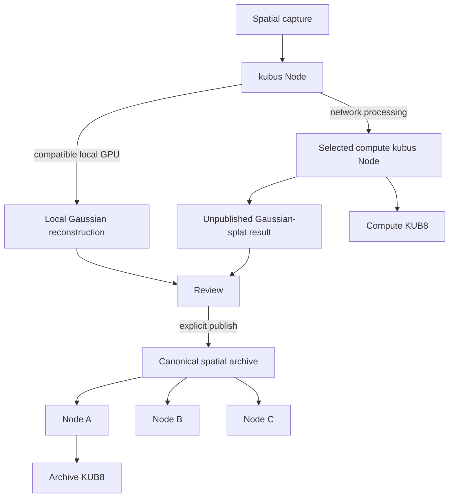

# kubus Node — runtime guide

### Local & distributed Gaussian splatting for a decentralised spatial archive.

Process spatial captures on your own GPU — or use an available GPU on the
kubus network. Published spatial archives are distributed through
community-run nodes instead of depending on a single storage provider.

**Your GPU when you have one. The kubus network when you don't.**

> kubus Node is a network participant, not a standalone Gaussian-splatting
> utility. The official runtime makes spatial-processing functionality
> available while the node is actively contributing storage and availability
> to the public art archive.

**Private compute in exchange for public infrastructure.** Operators receive local reconstruction, private local jobs, spatial-archive access and optional distributed GPU access. In return, every active official runtime must contribute backend-policy-compliant capacity to the canonical public archive.



## In 30 seconds

kubus Node combines five boundaries in one open-source runtime:

- a Kubo/IPFS public archive participant with deterministic, byte-aware HOT/WARM/COLD replication;
- a paired `/local/v1` API for art.kubus without exposing operator credentials;
- an optional NVIDIA/CUDA Nerfstudio + gsplat worker for local Gaussian-splat reconstruction;
- an optional distributed-compute provider that receives encrypted temporary IPFS payloads under backend-issued leases;
- deliberate CID-first publication: private inputs and outputs are never canonical merely because a node reports them.

The art.kubus backend is the matchmaking and canonical trust boundary. It does not proxy large capture bytes and it is not a central Gaussian-processing server.

## Local Gaussian splatting

The local path is phone → paired node → private capture → local NVIDIA GPU → unpublished preview → user review → optional publication. Raw RGB, camera poses, intrinsics and depth remain below the node's private data root. Local/self jobs create no compute reward.

The worker uses the official Nerfstudio `1.1.5` image, `splatfacto`, and its compatible pinned `gsplat 1.4.0`. NVIDIA/CUDA is the only supported reconstruction target in this alpha. CPU reconstruction is not claimed or silently simulated.

## Distributed GPU compute

GPU sharing is opt-in. A requester discovers fresh, contributing, compatible nodes; chooses automatic ranking or a specific provider; encrypts the capture locally with AES-256-GCM; wraps the data key to the provider's X25519 key through HKDF; and adds only encrypted bytes to Kubo. The provider temporarily pins, decrypts and processes those bytes, returns content-addressed output, and removes its plaintext work directory.

The remote provider necessarily sees plaintext source data while running the job. Transport encryption protects the path and backend, not against the selected provider. For maximum privacy, process locally.

## Mandatory network participation

kubus Node is a network participant, not a standalone Gaussian-splatting utility. `NetworkParticipationGate` exposes `UNCONFIGURED`, `JOINING`, `CONTRIBUTING`, `DEGRADED`, and `LOCKED`. Spatial processing becomes available only after the node has verified its contribution to the public art archive: registration, backend policy, healthy Kubo, policy-minimum configured capacity, a synchronized canonical pin plan (including the verified zero-object bootstrap case), successful reconciliation of every planned CID, an active scheduler, and an accepted current heartbeat must coincide. A heartbeat alone establishes liveness, not participation. `MAX_PINNED_BYTES=1`, production skip-pinning, `kubus-node gui`, and direct local API calls do not bypass the gate.

A short outage may enter `DEGRADED` only after successful participation was previously verified: running work is not killed, canonical public content remains readable, and diagnostics remain available. New work locks after the grace period. A fresh or never-verified node remains `JOINING`. See [participation](PARTICIPATION.md).

## Released installation

Use the [installation overview](../README.md#install). The published alpha.6
Windows EXE opens account-authorized setup: sign in to art.kubus, review the
permissions, and authorize the Node. Normal setup does not require pasting an
operator token. Docker Desktop with its WSL 2 backend must be running. The ZIP
launcher remains an alternative and preserves Docker volumes by default.

The release's CLI supports Windows x64 and Linux x64, with Node.js >=20.19,
npm >=10, Docker Engine and Compose v2. It starts the same digest-pinned runtime.
The alpha channel is `edge`, beta is `beta`, stable is `latest`.
As of 2026-09-14, the public npm edge package remains unavailable; use the official GitHub
release tarball until the public registry channel is restored.

`kubus-node setup --headless` serves the loopback setup wizard for access through
an SSH tunnel. `kubus-node doctor --json` provides diagnostics. Select an exact
released CLI version before using `kubus-node update`; it applies that package's
manifest while preserving Docker volumes. Removing the global npm package only
removes the CLI, not runtime data. `kubus-node uninstall` preserves data unless
both `--delete-data --yes-delete-data` are explicitly supplied.

Windows supports archive participation and remote processing requests. Local
NVIDIA reconstruction remains validated on Linux Docker + NVIDIA/CUDA hosts;
this release does not establish Windows local GPU support.

## Quick start (operators)

```sh
cp .env.example .env
docker compose up --build
```

Set a scoped operator token, operator identity, node label, reachable endpoint and strong local GUI token. The backend policy currently controls the minimum committed public-archive capacity; the example allocates 50 GiB.

Spatial-capable NVIDIA/CUDA host:

```sh
docker compose --profile spatial up --build
```

Kubo RPC and worker HTTP remain private to the Compose network. The Kubo gateway and node UI are loopback-bound by default.

## Hardware

- Archive participation: the published CLI supports Windows x64 and Linux x64 Docker hosts with enough disk for the configured contribution. Do not infer ARM64 release support from source portability.
- Reconstruction/provider: Linux Docker host, NVIDIA GPU and driver compatible with the pinned Nerfstudio CUDA image, plus adequate VRAM for the requested tier.
- Remote-provider mode: explicitly set `OFFER_REMOTE_COMPUTE=true`; use concurrency, queue, input-size and free-VRAM limits from `.env.example`.

## Capture privacy and publication

Private captures and encrypted temporary inputs never enter the public object registry or public pin set. Processed output added to the node's ordinary Kubo is **unpublished and unlisted, not cryptographically private**: it is not canonical or replicated by archive policy, but a party who learns its CID may be able to retrieve it. Publication requires an authenticated artwork owner (or authorised moderator), valid CID/size/MIME roles, retrievability where policy requires it, and backend canonicalisation. Supported spatial roles are `spatial_preview` (HOT), `spatial_mobile` (WARM), and `spatial_archive` (COLD), grouped under one object/version bundle.

CID identity is canonical. Retrieval is local Kubo first, then IPFS/provider discovery and kubus peers, then configured HTTP gateways with CID verification; legacy backend files are a final compatibility fallback where still required. No architecture depends on `ipfs.io`.

## Two KUB8 contribution rails

Archive availability uses the historical `public-archive-stewardship-1` records unchanged and current `public-archive-stewardship-2` bundle-aware scoring. Verified canonical bytes, retrieval, reliability, policy classes, capped logarithmic weighting and diminishing returns drive an independent archive pool.

Distributed compute uses backend-issued leases, distinct requester/provider operators, signed provider receipts, a separately signed requester acknowledgement, retrievable output, `spatial-compute-units-1`, fraud caps and a separate compute pool. Raw GPU seconds, owning hardware, local jobs, failed/expired/cancelled work and duplicate receipts earn zero.

Both are pending control-plane records. Settlement is not active; KUB8 has no guaranteed payout or market return.

## Architecture and APIs

- [Architecture](architecture.md)
- [Local API](LOCAL_API.md)
- [Spatial processing](SPATIAL.md)
- [Participation gate](PARTICIPATION.md)
- [Distributed compute](DISTRIBUTED_COMPUTE.md)
- [Rewards](REWARDS.md)
- [Privacy](PRIVACY.md)
- [Remote paired-device transport](REMOTE_TRANSPORT.md)
- [Security](security.md)
- [Operator guide](operator-guide.md)
- [Release channels](RELEASES.md)

## Current limitations

- Alpha transport uses encrypted temporary IPFS payloads; direct QUIC/libp2p job transfer is not yet the preferred implementation.
- A selected compute provider sees plaintext while processing. Secure hardware/provider-proof privacy is not claimed.
- Reconstruction currently exports the archival PLY variant. Additional preview/mobile optimisation remains renderer-version dependent.
- Browser clients do not call insecure LAN nodes from HTTPS; Flutter Web uses browser-safe public resolution.
- KUB8 settlement is pending-record-only. The alpha abuse controls are not claimed to be Sybil-proof.

## Releases and source status

Channels are `alpha → edge`, `beta → beta`, and stable → `latest`; an alpha image never updates `latest`. Exact SemVer tags and image tags are immutable.

Current kubus Node source is licensed under `AGPL-3.0-only`; see [LICENSE](../LICENSE). Third-party software retains its [own licences](THIRD_PARTY_LICENSES.md), and the software licence does not grant rights to the [kubus branding](../TRADEMARKS.md) or automatically cover artwork and archive content. The published alpha.6 tag predates this change and retains its earlier bundled licensing notice.
